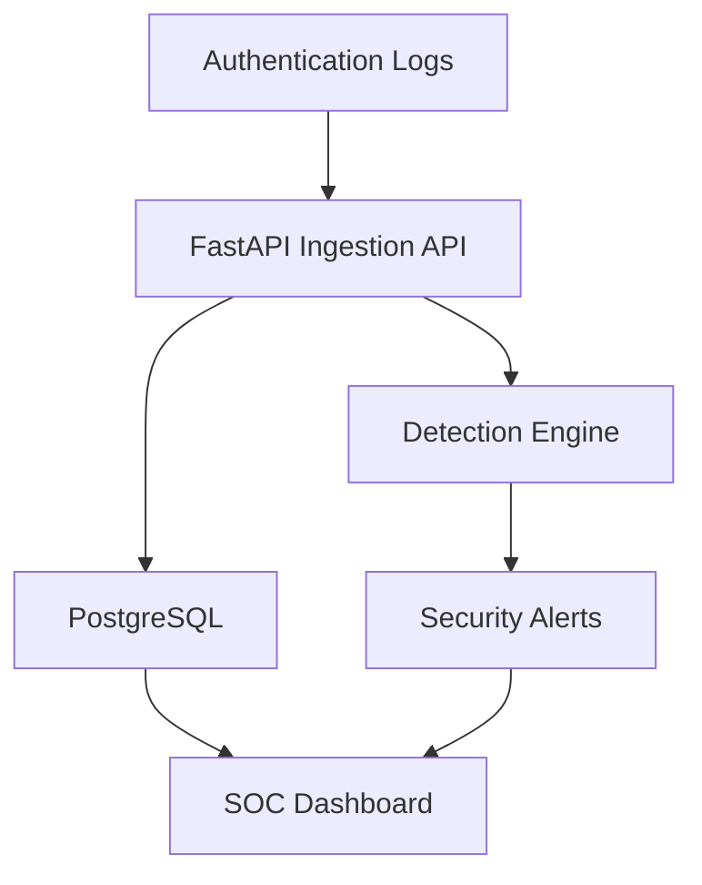

## Architecture



## Run locally

Requirements:

- Docker Desktop
- Docker Compose

Clone the repository and create the local environment file:

```bash
git clone https://github.com/bioonahnuu-design/sentinel-soc-dashboard-nahnu.git
cd sentinel-soc-dashboard-nahnu
cp .env.example .env
```

Replace every `CHANGE_ME` and `REPLACE_WITH...` value inside `.env`, then start the application:

```bash
docker compose up --build -d
```

Open:

```text
http://localhost:8000
```

Generate realistic demo traffic:

```bash
docker compose exec web python scripts/generate_demo_logs.py
```

Stop the project:

```bash
docker compose down
```

> Do not add `-v` unless you intentionally want to delete the PostgreSQL volume.

## Health checks

| Endpoint        | Purpose                                         |
| --------------- | ----------------------------------------------- |
| `/health/live`  | Confirms the application process is running     |
| `/health/ready` | Confirms the application and database are ready |
| `/docs`         | Opens the interactive FastAPI documentation     |

## API examples

Send a security event:

```bash
curl -X POST http://localhost:8000/api/logs \
  -H "Content-Type: application/json" \
  -d '{
    "timestamp": "2026-07-17T10:00:00Z",
    "source_ip": "203.0.113.10",
    "username": "admin",
    "event_type": "login",
    "status": "failed",
    "country": "Indonesia"
  }'
```

Useful endpoints:

| Method  | Endpoint                       | Purpose                                 |
| ------- | ------------------------------ | --------------------------------------- |
| `POST`  | `/api/logs`                    | Ingest an event and run detection rules |
| `POST`  | `/api/logs/upload`             | Import CSV or JSON logs                 |
| `GET`   | `/api/logs`                    | Fetch recent security events            |
| `GET`   | `/api/alerts`                  | List and filter detections              |
| `GET`   | `/api/alerts/{id}`             | Retrieve incident details               |
| `GET`   | `/api/alerts/{id}/report`      | Export an incident report               |
| `PATCH` | `/api/alerts/{id}/acknowledge` | Acknowledge an incident                 |
| `GET`   | `/api/stats/overview`          | Retrieve dashboard metrics              |
| `GET`   | `/api/stats/timeline`          | Retrieve the event timeline             |
| `GET`   | `/api/stats/top-ips`           | Retrieve top failed-login sources       |

## Test

Run the automated test suite inside Docker:

```bash
docker compose run --rm -v "./tests:/app/tests:ro" web \
  python -m pytest -q /app/tests
```

Expected result:

```text
7 passed
```

## Security features

- Environment-based secret management
- PBKDF2 password hashing
- Secure analyst authentication
- Session expiration
- Login rate limiting
- Brute-force login detection
- Production configuration guards
- Database readiness monitoring
- Alert acknowledgement workflow
- Local Chart.js dependency without CDN reliance

## Next security upgrades

- JWT authentication with analyst and administrator roles
- GeoIP enrichment and IP reputation lookup
- WebSocket-based real-time alert delivery
- Sigma-compatible detection rules
- Webhook-based log collectors
- Alembic database migrations
- Azure-hosted application and PostgreSQL infrastructure

## Disclaimer

This project is intended for cybersecurity education, defensive monitoring, and portfolio demonstration. All included events and IP addresses are synthetic or reserved for documentation.

## Author

**Nahnu Rohmania**  
Informatics Engineering student and cybersecurity enthusiast.
