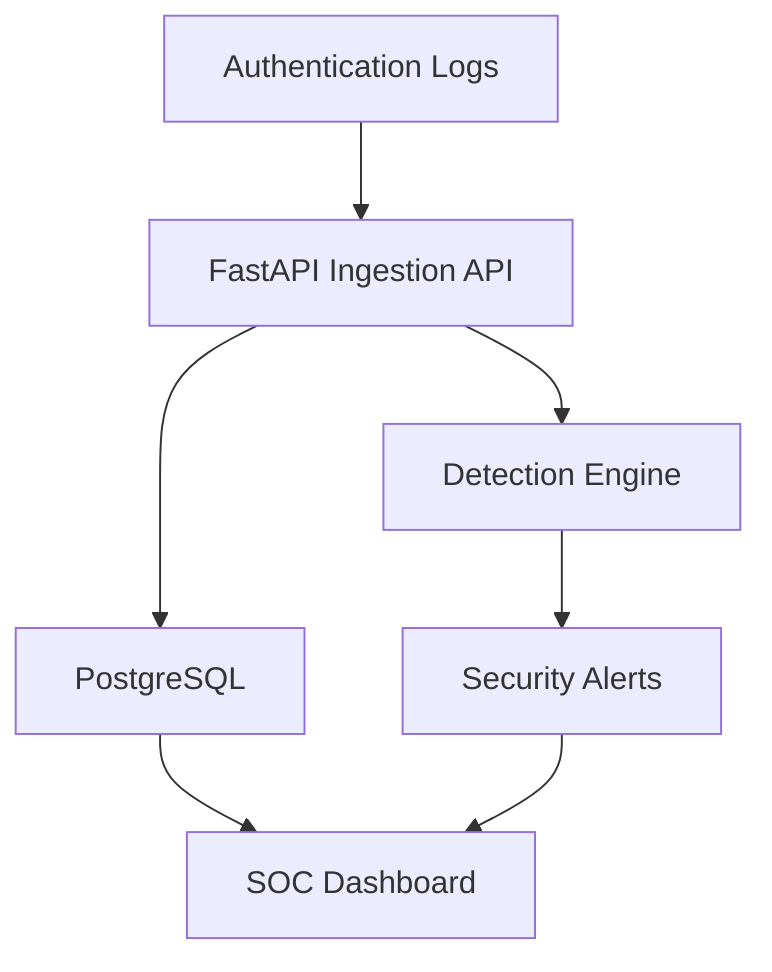

# Sentinel SOC Dashboard


A full-stack Security Operations Center dashboard for ingesting authentication logs, detecting suspicious login activity, managing security alerts, and visualizing security telemetry.

This project demonstrates a simplified SIEM workflow:

**Logs → Detection Engine → Security Alerts → Analyst Investigation**

## Dashboard preview


The dashboard displays authentication activity, failed login attempts, active alerts, unique source IPs, suspicious sources, and incidents requiring analyst review.

## Key features

- Authentication-log ingestion through a FastAPI REST API
- PostgreSQL storage for security events and alerts
- Brute-force detection based on repeated failed login attempts
- Suspicious-location login detection
- Analyst authentication and session expiration
- Login rate limiting
- Search by source IP address or username
- Time-range filtering
- Alert filtering by severity and status
- Alert acknowledgement workflow
- Incident-detail modal with raw source logs
- Incident-report export
- CSV and JSON bulk log import
- Dashboard metrics and event timeline
- Top failed-login source visualization
- Local Chart.js dependency without CDN reliance
- Loading state, retry connection, and backend-offline warning
- Application and database health checks
- Docker-based development environment
- Automated API and detection tests

## Architecture



## Technology stack

| Layer             | Technology                      |
| ----------------- | ------------------------------- |
| Frontend          | HTML, CSS, JavaScript, Chart.js |
| Backend           | Python, FastAPI                 |
| Database          | PostgreSQL                      |
| ORM               | SQLAlchemy                      |
| Validation        | Pydantic                        |
| Testing           | Pytest                          |
| Containerization  | Docker and Docker Compose       |
| API documentation | OpenAPI and Swagger UI          |

## Project structure

```text
sentinel-soc-dashboard/
├── app/
│   ├── api.py
│   ├── auth.py
│   ├── config.py
│   ├── database.py
│   ├── detection.py
│   ├── main.py
│   ├── models.py
│   └── schemas.py
├── docs/
│   └── images/
│       └── dashboard-overview.jpeg
├── frontend/
│   ├── vendor/
│   │   └── chart.umd.js
│   ├── app.js
│   ├── index.html
│   ├── login.css
│   ├── login.html
│   ├── login.js
│   └── styles.css
├── samples/
│   ├── security_logs.csv
│   └── security_logs.json
├── scripts/
│   └── generate_demo_logs.py
├── tests/
│   ├── test_api.py
│   └── test_detection.py
├── .env.example
├── Dockerfile
├── docker-compose.yml
├── requirements.txt
└── README.md
```

## Run locally

### Requirements

- Docker Desktop
- Docker Compose
- Git

### 1. Clone the repository

```bash
git clone https://github.com/bioonahnuu-design/sentinel-soc-dashboard-nahnu.git
cd sentinel-soc-dashboard-nahnu
```

### 2. Create the environment file

Linux or macOS:

```bash
cp .env.example .env
```

Windows PowerShell:

```powershell
Copy-Item .env.example .env
```

Open `.env` and replace every `CHANGE_ME` and `REPLACE_WITH...` placeholder.

Never commit the completed `.env` file.

### 3. Start the application

```bash
docker compose up --build -d
```

Check the containers:

```bash
docker compose ps
```

Expected services:

```text
db     Up (healthy)
web    Up (healthy)
```

### 4. Open the dashboard

```text
http://localhost:8000
```

Interactive API documentation:

```text
http://localhost:8000/docs
```

### 5. Generate demo security events

```bash
docker compose exec web python scripts/generate_demo_logs.py
```

Refresh the dashboard to display the generated events and alerts.

### 6. Stop the application

```bash
docker compose down
```

> Do not add `-v` unless you intentionally want to delete the PostgreSQL volume and its stored data.

## Health checks

| Endpoint        | Purpose                                              |
| --------------- | ---------------------------------------------------- |
| `/health/live`  | Confirms that the application process is running     |
| `/health/ready` | Confirms that the application and database are ready |
| `/docs`         | Opens the interactive FastAPI documentation          |

Example healthy responses:

```json
{
  "status": "alive"
}
```

```json
{
  "status": "healthy",
  "database": "connected"
}
```

## API endpoints

| Method  | Endpoint                       | Purpose                                         |
| ------- | ------------------------------ | ----------------------------------------------- |
| `POST`  | `/api/logs`                    | Ingest a security event and run detection rules |
| `POST`  | `/api/logs/upload`             | Import CSV or JSON security logs                |
| `GET`   | `/api/logs`                    | Retrieve recent security events                 |
| `GET`   | `/api/alerts`                  | List and filter security alerts                 |
| `GET`   | `/api/alerts/{id}`             | Retrieve incident details                       |
| `GET`   | `/api/alerts/{id}/report`      | Export an incident report                       |
| `PATCH` | `/api/alerts/{id}/acknowledge` | Acknowledge an incident                         |
| `GET`   | `/api/stats/overview`          | Retrieve dashboard metrics                      |
| `GET`   | `/api/stats/timeline`          | Retrieve the event timeline                     |
| `GET`   | `/api/stats/top-ips`           | Retrieve top failed-login sources               |

Protected API endpoints require an authenticated analyst session.

## Detection rules

### Brute-force login detection

Creates an alert when one source IP generates at least five failed login attempts within ten minutes.

### Suspicious-location login detection

Creates an alert when a successful login originates from a flagged or unexpected location.

## Testing

Run the automated tests inside Docker:

```bash
docker compose run --rm \
  -e APP_ENV=local \
  -e AUTH_SECRET=local-development-secret-change-before-hosting \
  -v "./:/app" \
  web python -m pytest -q /app/tests
```

Expected result:

```text
7 passed
```

The tests cover:

- Log ingestion
- API responses
- Alert generation
- Detection logic
- Authentication behavior
- Production configuration guards
- Database-backed operations

## Security design

- Environment-based secret management
- PBKDF2 password hashing
- Analyst authentication
- Expiring sessions
- Login rate limiting
- Brute-force detection
- Production configuration validation
- Secure-cookie enforcement in production
- PostgreSQL SSL enforcement in production
- Database readiness monitoring
- Alert acknowledgement workflow
- Secrets excluded through `.gitignore`

## Production checklist

Before deployment:

- Generate a new production password
- Generate a long random `AUTH_SECRET`
- Store secrets in the hosting platform's environment variables
- Set `APP_ENV=production`
- Set `AUTH_SECURE_COOKIE=true`
- Enable HTTPS
- Use a PostgreSQL connection with `sslmode=require`
- Never use test credentials in production
- Never commit `.env`

## Roadmap

- Azure-hosted application and PostgreSQL infrastructure
- JWT authentication with analyst and administrator roles
- GeoIP enrichment
- IP reputation lookup
- WebSocket-based real-time alert delivery
- Sigma-compatible detection rules
- Webhook-based log collectors
- Alembic database migrations
- Automated GitHub Actions testing
- Microsoft Sentinel integration concept

## Disclaimer

This project is intended for cybersecurity education, defensive monitoring, and portfolio demonstration.

All included events and IP addresses are synthetic, private, or reserved for documentation. Do not use this project to monitor systems without authorization.

## Author

**Nahnu Rohmania**

Informatics Engineering student at Universitas 17 Agustus 1945 Surabaya with an interest in cybersecurity, security monitoring, networking, Python, and cloud security.
