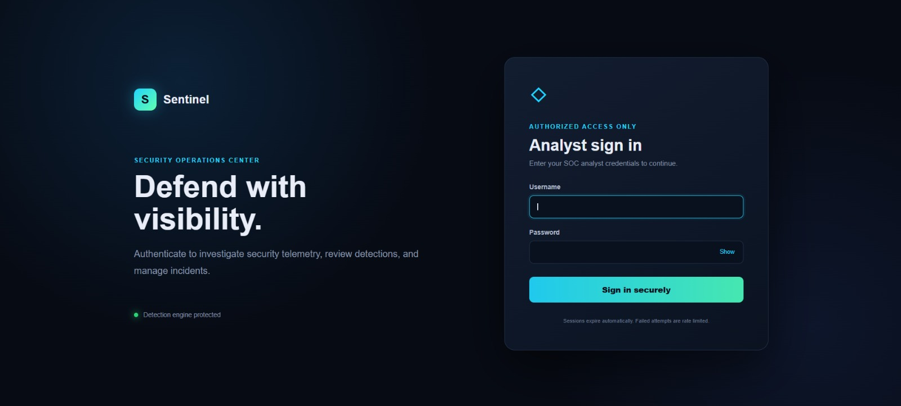
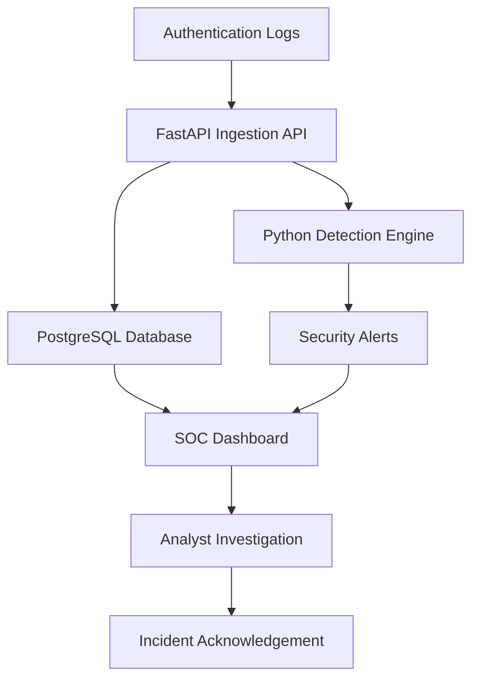

# Sentinel SOC Dashboard


A full-stack Security Operations Center monitoring dashboard for ingesting authentication logs, detecting suspicious login activity, managing security alerts, and visualizing security telemetry.

This project demonstrates a simplified SIEM workflow:

**Logs → Detection Engine → Security Alerts → Analyst Investigation**

> This is a custom educational mini-SIEM inspired by common Security Operations Center workflows. It does not currently use or integrate with Microsoft Sentinel.

## Dashboard Preview



The dashboard displays authentication activity, failed login attempts, active alerts, unique source IPs, suspicious sources, and incidents requiring analyst investigation.

## Implemented Features

- Authentication-log ingestion through a FastAPI REST API
- CSV and JSON bulk log import
- PostgreSQL storage for security events and alerts
- Brute-force login detection
- Suspicious-location login detection
- Analyst authentication and session expiration
- Login rate limiting
- Search by source IP address or username
- Time-range filtering
- Alert filtering by severity and status
- Alert acknowledgement workflow
- Incident-detail modal with raw source logs
- Incident-report export
- Dashboard metrics and security event timeline
- Top failed-login source visualization
- Local Chart.js dependency without CDN reliance
- Loading states and retry connection controls
- Backend-offline warning
- Application liveness health check
- Database readiness health check
- Docker-based local development
- Automated API and detection tests

## Architecture



## Technology Stack

| Layer              | Technology                       |
| ------------------ | -------------------------------- |
| Frontend           | HTML, CSS, JavaScript, Chart.js  |
| Backend            | Python 3.12, FastAPI             |
| Database           | PostgreSQL hosted on Neon        |
| ORM                | SQLAlchemy                       |
| Validation         | Pydantic                         |
| API documentation  | OpenAPI and Swagger UI           |
| Authentication     | Signed session cookie and PBKDF2 |
| Testing            | Pytest                           |
| Local environment  | Docker and Docker Compose        |
| Production hosting | Vercel                           |
| Version control    | Git and GitHub                   |

## Current Deployment

The production system uses the following architecture:

- FastAPI application and frontend deployed on Vercel
- Managed PostgreSQL database hosted on Neon
- Encrypted PostgreSQL connection using SSL
- Production secrets managed through Vercel environment variables
- Automatic deployment from the GitHub `main` branch
- Docker Compose used for local development and testing
- Application liveness and database readiness endpoints

Neon may operate its infrastructure through a cloud region, but this project uses Neon as a managed database provider. It does not directly deploy or manage AWS infrastructure.

## Project Structure

```text
sentinel-soc-dashboard/
├── app/
│   ├── __init__.py
│   ├── api.py
│   ├── auth.py
│   ├── config.py
│   ├── database.py
│   ├── detection.py
│   ├── main.py
│   ├── models.py
│   └── schemas.py
├── docs/
│   └── images/
│       └── dashboard-overview.jpeg
├── frontend/
│   ├── vendor/
│   │   └── chart.umd.js
│   ├── app.js
│   ├── index.html
│   ├── login.css
│   ├── login.html
│   ├── login.js
│   └── styles.css
├── samples/
│   ├── security_logs.csv
│   └── security_logs.json
├── scripts/
│   └── generate_demo_logs.py
├── tests/
│   ├── test_api.py
│   └── test_detection.py
├── .dockerignore
├── .env.example
├── .gitignore
├── Dockerfile
├── docker-compose.yml
├── requirements.txt
└── README.md
```

## Run Locally

### Requirements

- Docker Desktop
- Docker Compose
- Git

### 1. Clone the repository

```bash
git clone https://github.com/bioonahnuu-design/sentinel-soc-dashboard-nahnu.git
cd sentinel-soc-dashboard-nahnu
```

### 2. Create the environment file

Linux or macOS:

```bash
cp .env.example .env
```

Windows PowerShell:

```powershell
Copy-Item .env.example .env
```

Open `.env` and replace every `CHANGE_ME` and `REPLACE_WITH...` placeholder.

Never commit the completed `.env` file.

### 3. Start the application

Make sure Docker Desktop is running, then execute:

```bash
docker compose up --build -d
```

Check the containers:

```bash
docker compose ps
```

Expected services:

```text
db     Up (healthy)
web    Up (healthy)
```

### 4. Open the application

Dashboard:

```text
http://localhost:8000
```

Interactive API documentation:

```text
http://localhost:8000/docs
```

### 5. Generate demo security events

```bash
docker compose exec web python scripts/generate_demo_logs.py
```

Refresh the dashboard to display the generated events and alerts.

Alternatively, use the **Import logs** button to upload one of the sample files:

```text
samples/security_logs.csv
samples/security_logs.json
```

### 6. Stop the application

```bash
docker compose down
```

> Do not add `-v` unless you intentionally want to delete the PostgreSQL volume and all locally stored data.

## Health Checks

| Endpoint        | Purpose                                              |
| --------------- | ---------------------------------------------------- |
| `/health/live`  | Confirms that the application process is running     |
| `/health/ready` | Confirms that the application and database are ready |
| `/docs`         | Opens the interactive FastAPI API documentation      |

Example liveness response:

```json
{
  "status": "alive"
}
```

Example readiness response:

```json
{
  "status": "healthy",
  "database": "connected"
}
```

## API Endpoints

| Method  | Endpoint                       | Purpose                                         |
| ------- | ------------------------------ | ----------------------------------------------- |
| `POST`  | `/api/logs`                    | Ingest a security event and run detection rules |
| `POST`  | `/api/logs/upload`             | Import CSV or JSON security logs                |
| `GET`   | `/api/logs`                    | Retrieve recent security events                 |
| `GET`   | `/api/alerts`                  | List and filter security alerts                 |
| `GET`   | `/api/alerts/{id}`             | Retrieve incident details                       |
| `GET`   | `/api/alerts/{id}/report`      | Export an incident report                       |
| `PATCH` | `/api/alerts/{id}/acknowledge` | Acknowledge an incident                         |
| `GET`   | `/api/stats/overview`          | Retrieve dashboard metrics                      |
| `GET`   | `/api/stats/timeline`          | Retrieve the security event timeline            |
| `GET`   | `/api/stats/top-ips`           | Retrieve top failed-login sources               |

Protected API endpoints require an authenticated analyst session.

## Detection Rules

### Brute-Force Login Detection

Creates a security alert when one source IP generates at least five failed login attempts within ten minutes.

This rule demonstrates how authentication logs can be correlated within a time window to identify potential password-guessing activity.

### Suspicious-Location Login Detection

Creates a security alert when a successful login originates from a flagged or unexpected location.

This rule demonstrates contextual analysis of successful authentication events that may require analyst investigation.

## Incident Investigation Workflow

The dashboard provides a simplified SOC investigation workflow:

1. Authentication logs are ingested through the API or file upload.
2. The detection engine evaluates each log.
3. Matching activity creates a security alert.
4. The alert appears in the Recent Alerts table.
5. The analyst opens the incident detail.
6. The analyst reviews the detection rule, source IP, username, timestamp, country, and raw log.
7. The incident can be acknowledged after review.
8. An incident report can be exported for documentation.

## Testing

Run the automated tests inside Docker:

```powershell
docker compose run --rm `
  -e APP_ENV=local `
  -e AUTH_SECRET=local-development-secret-change-before-hosting `
  -v "${PWD}\tests:/app/tests:ro" `
  web python -m pytest -q /app/tests
```

Linux or macOS:

```bash
docker compose run --rm \
  -e APP_ENV=local \
  -e AUTH_SECRET=local-development-secret-change-before-hosting \
  -v "${PWD}/tests:/app/tests:ro" \
  web python -m pytest -q /app/tests
```

Expected result:

```text
7 passed
```

The automated tests cover:

- Log ingestion
- API responses
- Alert generation
- Detection logic
- Authentication behavior
- Production configuration guards
- Database-backed operations

## Security Design

- Environment-based secret management
- PBKDF2 password hashing
- Constant-time password comparison
- Analyst authentication
- Signed session tokens
- HTTP-only session cookies
- Session expiration
- Login rate limiting
- Brute-force detection
- Production configuration validation
- Secure-cookie enforcement in production
- PostgreSQL SSL enforcement in production
- Database readiness monitoring
- Alert acknowledgement workflow
- Secrets excluded through `.gitignore`

## Production Configuration

The deployed application uses environment variables for sensitive configuration.

Important production settings include:

```text
APP_ENV=production
AUTH_SECURE_COOKIE=true
DATABASE_URL=<managed PostgreSQL connection>
SOC_USERNAME=<production analyst username>
SOC_PASSWORD_HASH=<generated PBKDF2 hash>
AUTH_SECRET=<long random production secret>
```

Sensitive values must only be stored in the hosting platform's environment-variable settings.

Never commit:

- `.env`
- Database passwords
- PostgreSQL connection strings
- Plaintext analyst passwords
- Production password hashes
- Authentication secrets

## Production Checklist

Before deploying a new version:

- Generate a dedicated production password
- Generate a long and random `AUTH_SECRET`
- Store secrets in the hosting platform's environment variables
- Set `APP_ENV=production`
- Set `AUTH_SECURE_COOKIE=true`
- Use HTTPS
- Use a PostgreSQL connection with `sslmode=require`
- Confirm `/health/live` returns a healthy response
- Confirm `/health/ready` reports that the database is connected
- Run the automated tests
- Never use sample or test credentials in production
- Never commit `.env`

## Known Limitations

- The detection engine currently uses custom Python rules
- The project does not currently use Microsoft Sentinel
- The project does not currently support analyst and administrator roles
- Alerts are refreshed through API requests rather than WebSocket delivery
- GeoIP and external IP reputation enrichment are not yet implemented
- Database schema changes are not yet managed with Alembic migrations
- The included logs and IP addresses are synthetic or reserved for documentation

## Future Improvements

- Analyst and administrator roles
- JWT-based API authentication
- GeoIP enrichment
- External IP reputation lookup
- WebSocket-based real-time alert delivery
- Sigma-compatible detection rules
- Webhook-based log collectors
- Alembic database migrations
- Automated testing through GitHub Actions
- Improved alert severity classification
- Extended detection-rule coverage
- Optional Microsoft Sentinel integration

## Portfolio Case Study

### Problem

Authentication logs are difficult to investigate when they are distributed across raw files and do not provide centralized alerting or visualization.

### Solution

This project provides a simplified SOC monitoring workflow that centralizes authentication logs, evaluates suspicious behavior, creates security alerts, and presents the results through an analyst dashboard.

### Outcome

The completed system can:

- Import authentication events from CSV and JSON files
- Store events in a managed PostgreSQL database
- Detect repeated failed login activity
- Identify suspicious successful logins
- Display security metrics and attacking source IPs
- Support incident investigation and acknowledgement
- Export incident reports
- Run locally through Docker
- Operate as a deployed web application

## Disclaimer

This project is intended for cybersecurity education, defensive security monitoring, and portfolio demonstration.

All included events and IP addresses are synthetic, private, or reserved for documentation. Do not use this project to monitor systems without authorization.

## Author

**Nahnu Rohmania**

Informatics Engineering student at Universitas 17 Agustus 1945 Surabaya with an interest in cybersecurity, security monitoring, networking, Python, and cloud security.

GitHub: [bioonahnuu-design](https://github.com/bioonahnuu-design)
